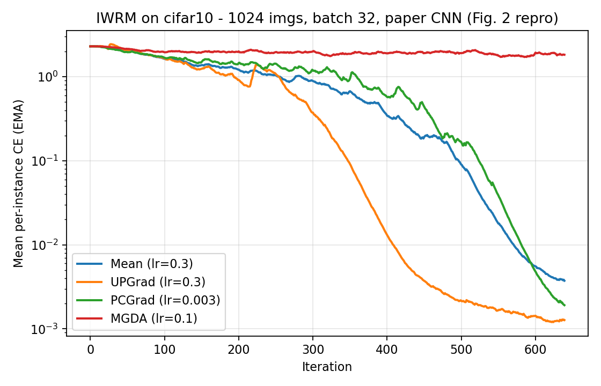
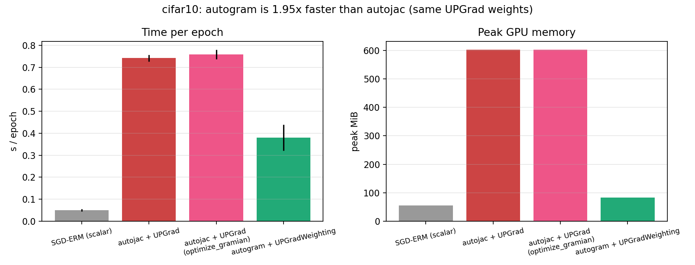
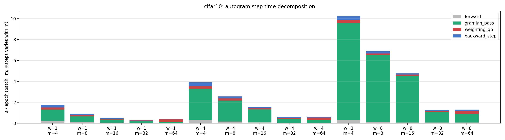
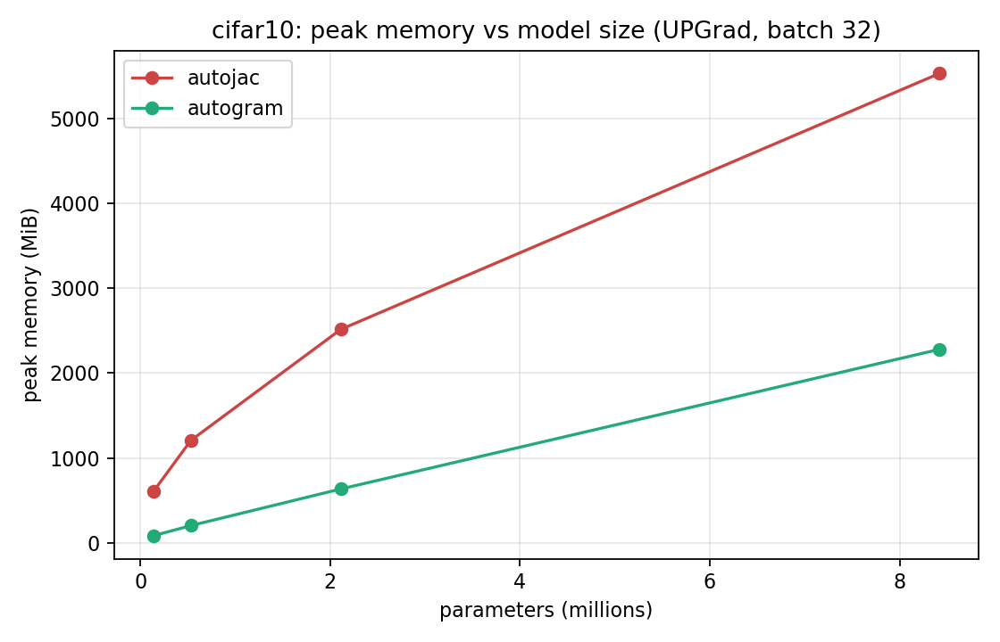

***

### 2. `RESULTS.md`


```markdown
# Phase 2.5 Results — CIFAR-10, RTX 5070 Ti Laptop, TorchJD 0.17.0

*Full-precision runs (10 timed epochs, 3 warmup unless noted). All code in `iwrm_bench.py` / `run_all.py`; raw JSON + logs in `results/`. Preflight passed (gate 3 max param diff 5.96e-08, tolerance 5e-4).*

---

### 1. Figure 2 Reproduction


* **UPGrad** (lr=0.3) converges fastest and lowest, matching the paper's headline result. 
* **PCGrad** (lr=0.003, much smaller — unstable at every larger lr in the sweep) converges more slowly but reaches a comparable final loss. 
* **MGDA** (lr=0.1) never learns — flat at 1.8–2.2 for the full 640 iterations. This is a stronger result than "MGDA is slower" — it's complete non-convergence. 
    * *Open Question:* Is this a genuine MGDA stationary-point pathology, or an artifact of the AUC-based lr sweep being unable to discriminate learning rates when the curve never moves?

### 2. Table 7 — Timing Ratio Validation
| Method | ours s/epoch | ours ratio | paper ratio |
| :--- | :--- | :--- | :--- |
| **SGD-ERM** | 0.059 ± 0.004 | 0.08 | 0.28 |
| **Mean** | 0.731 ± 0.016 | 1.00 | 1.00 |
| **UPGrad** | 0.915 ± 0.041 | 1.25 | 1.14 |
| **PCGrad** | 1.300 ± 0.050 | 1.78 | 1.78 |
| **MGDA** | 2.103 ± 0.644 | 2.88 | 2.97 |

PCGrad matches exactly; UPGrad and MGDA are close. SGD-ERM is proportionally cheaper on our GPU than the paper's (plausible raw-throughput difference with zero aggregation overhead). MGDA's high standard deviation (±0.644) reflects its heavier, highly variable inner QP solve.

### 3. Engines — `autojac` vs `autogram`


| Config | s/epoch | peak MiB |
| :--- | :--- | :--- |
| **SGD-ERM (scalar)** | 0.050 | 54.5 |
| **autojac + UPGrad** | 0.741 | 602.6 |
| **autojac + UPGrad (optimize_gramian)** | 0.758 | 602.6 |
| **autogram + UPGradWeighting** | 0.380 | 83.2 |

* **Time:** 1.95x speedup. 
* **Memory:** 7.25x reduction. 

The memory win dwarfs the time win — consistent with the paper's claim that `autojac`'s bottleneck is memory management, not raw compute. Furthermore, `optimize_gramian_computation=True` produces zero measured benefit at this model size (0.13M params); the concatenated-Jacobian buffer isn't yet the dominant cost.

### 4. Sub-routine Decomposition


**QP share at RL-relevant $m$, across width:**
| width (params) | m=4 QP share | m=8 QP share |
| :--- | :--- | :--- |
| **1 (0.13M)** | 10.7% | 12.1% |
| **4 (2.1M)** | 6.5% | 6.7% |
| **8 (8.4M)** | 2.5% | 2.7% |

The QP share shrinks monotonically as $N$ (params) grows at a fixed small $m$. Meanwhile, the `gramian_pass` (the vjp+jvp accumulation) grows to 8.9s absolute at w=8, m=4 — the single largest bar in the sweep. 
* **Conclusion:** At RL-relevant $m$ (4–8), Gramian accumulation dominates execution, rendering the QP proportionally irrelevant.

### 5. Memory Scaling vs Model Size


| width | params | autojac peak | autogram peak | ratio |
| :--- | :--- | :--- | :--- | :--- |
| **1** | 0.13M | 603 MiB | 83 MiB | 7.25x |
| **2** | 0.53M | 1207 MiB | 203 MiB | 5.95x |
| **4** | 2.11M | 2516 MiB | 635 MiB | 3.96x |
| **8** | 8.42M | 5530 MiB | 2279 MiB | 2.43x |

Both curves grow with $N$. Interestingly, the ratio *shrinks* as $N$ increases — the opposite of the naive "advantage compounds at scale" hypothesis. Back-of-the-envelope: the actual [m=32, n_params] Jacobian at w=1 is only ~17 MB, far below the 603 MB peak. 
* *Observation:* `autojac`'s peak is dominated by near-constant overhead beyond the Jacobian matrix itself. The asymptotic slope ratio may be smaller than the small-$N$ ratio suggests. (Candidate for `torch.cuda.memory_snapshot` in Phase 3).

---

### Phase 3 Recommendation
**Prioritize Gramian/Triton kernel optimization over batched-QP work for the RL-relevant regime ($m=4–8$, large $N$).**

While QP-batching ($\mathcal{O}(m^5) \rightarrow \mathcal{O}(m^4)$) is a well-scoped improvement (TorchJD currently solves the $m$ QPs sequentially on CPU via `np.apply_along_axis`), the data above proves it is not the bottleneck at our target scale.