# RESULTS — Jacobian Descent on GPT-2 124M

`NVIDIA RTX A5000` · torch `2.4.1+cu121` · torchjd `0.17.0` · fp32 · T=512 · SGD lr=0.01 · 100 steps · 104 run dirs · 1100 timed cells

Ratios are `engine ÷ single-objective control measured in the same run`. Timing = min over replicates; memory = any (bit-identical across all 312 replicate groups).

---

## 1. Acceptance — duplicate objectives, T=512, UPGrad

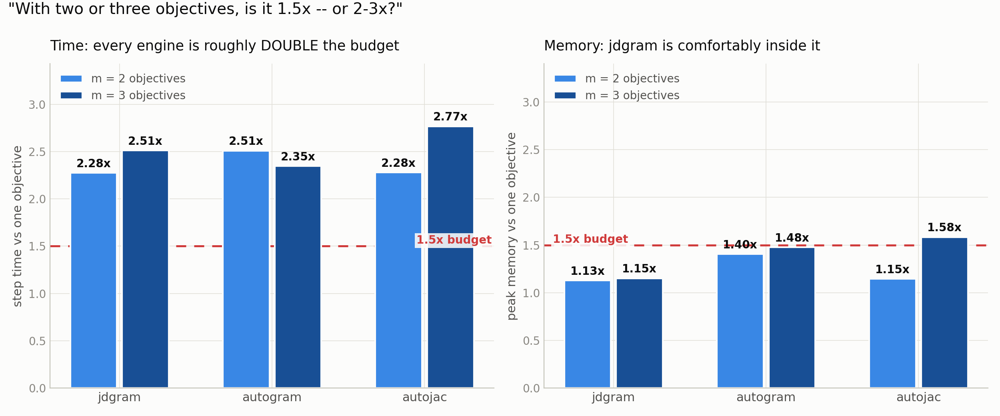

| m | jdgram t | jdgram mem | autogram t | autogram mem | autojac t | autojac mem |
|---|---|---|---|---|---|---|
| 1 | 2.005 | 1.000 | 2.391 | 1.247 | 1.238 | 0.830 |
| 2 | 2.275 | 1.129 | 2.510 | 1.404 | 2.280 | 1.146 |
| 3 | 2.512 | 1.151 | 2.346 | 1.476 | 2.767 | 1.584 |
| 4 | 2.452 | 1.166 | 2.187 | 1.522 | 3.011 | 2.044 |
| 6 | 2.372 | 1.184 | 2.222 | 1.578 | 4.600 | 2.999 |
| 8 | 2.331 | 1.194 | 2.187 | 1.611 | 5.905 | 3.974 |
| 12 | 2.291 | 1.206 | 2.161 | 1.648 | -- | -- |
| 16 | 2.257 | 1.212 | 2.143 | 1.668 | -- | -- |

Budget = 1.5x on both axes.

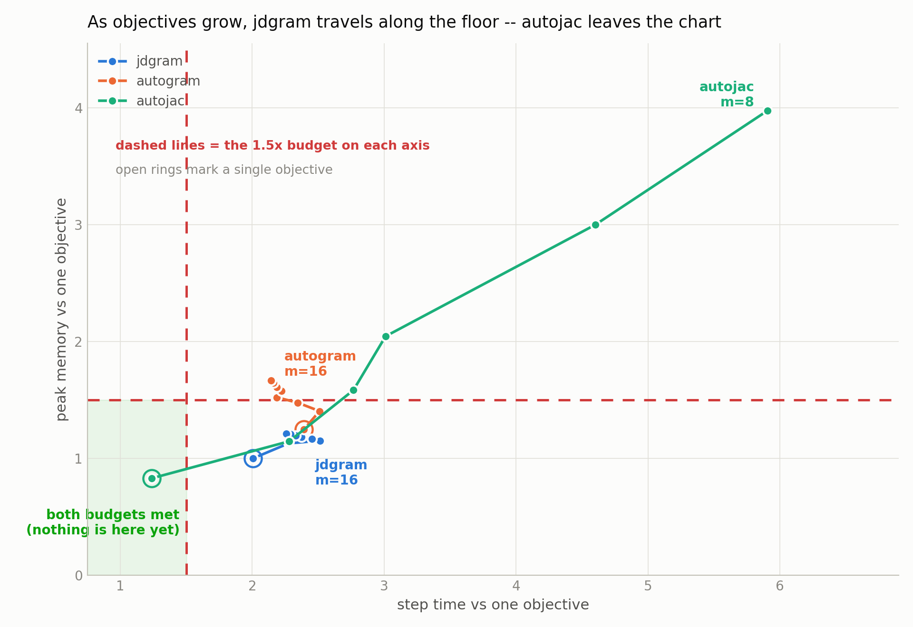

## 2. Step composition (L4 phases, dfirst, T=512)

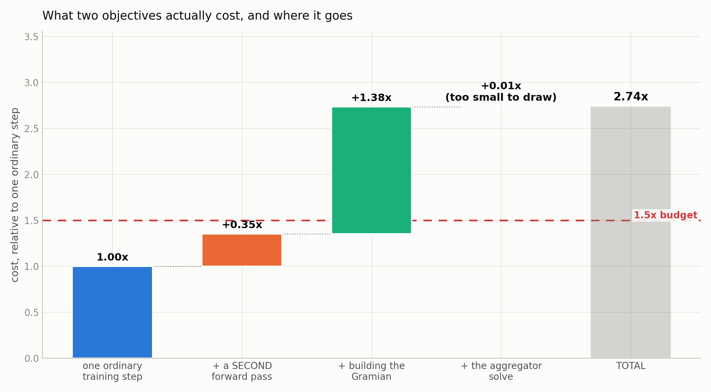

| m | baseline | 2nd forward | Gramian machinery | aggregator QP | total | floor (free Gramian) | fused | fused floor |
|---|---|---|---|---|---|---|---|---|
| 1 | 1.000 | 0.329 | 0.779 | 0.0090 | 2.117 | 1.338 | 1.788 | 1.009 |
| 2 | 1.000 | 0.354 | 1.380 | 0.0056 | 2.739 | 1.359 | 2.386 | 1.006 |
| 3 | 1.000 | 0.360 | 1.190 | 0.0041 | 2.555 | 1.364 | 2.194 | 1.004 |
| 4 | 1.000 | 0.369 | 1.082 | 0.0033 | 2.455 | 1.372 | 2.086 | 1.003 |
| 6 | 1.000 | 0.373 | 0.999 | 0.0028 | 2.374 | 1.375 | 2.002 | 1.003 |
| 8 | 1.000 | 0.385 | 0.937 | 0.0021 | 2.324 | 1.387 | 1.939 | 1.002 |
| 12 | 1.000 | 0.389 | 0.893 | 0.0019 | 2.285 | 1.391 | 1.895 | 1.002 |
| 16 | 1.000 | 0.402 | 0.859 | 0.0018 | 2.262 | 1.404 | 1.860 | 1.002 |
| 24 | 1.000 | 0.402 | 0.839 | 0.0024 | 2.244 | 1.405 | 1.842 | 1.002 |

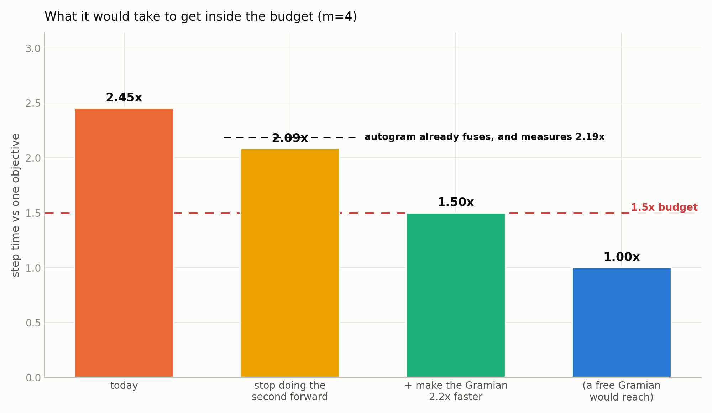

## 3. Cost model — absolute ms/step (jdgram dfirst vs control)

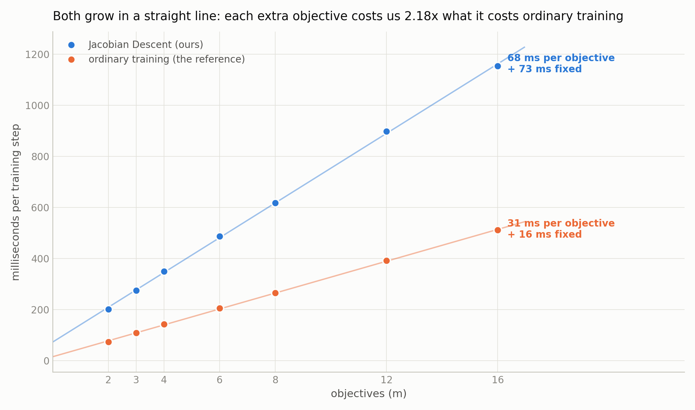

| m | jdgram ms | control ms | ratio |
|---|---|---|---|
| 1 | 86.6 | 41.2 | 2.102 |
| 2 | 201.9 | 73.9 | 2.732 |
| 3 | 274.8 | 108.8 | 2.526 |
| 4 | 349.4 | 142.5 | 2.452 |
| 6 | 487.3 | 205.5 | 2.372 |
| 8 | 618.2 | 265.3 | 2.331 |
| 12 | 897.9 | 391.9 | 2.291 |
| 16 | 1154.1 | 511.3 | 2.257 |

|  | ms per objective | ms fixed per step |
|---|---|---|
| control | 31.1 | 15.8 |
| jdgram | 68.0 | 73.3 |
| ratio | 2.18 | 4.6 |

Linear fit over m=2..16; predicts every measured point to <0.5%.

## 4. Objective relationship (jdgram dfirst, T=512, UPGrad)

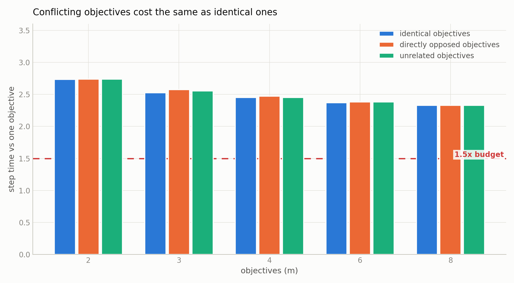

| m | identical | opposed | unrelated |
|---|---|---|---|
| 1 | 2.102 | 2.169 | 2.131 |
| 2 | 2.732 | 2.738 | 2.739 |
| 3 | 2.526 | 2.573 | 2.555 |
| 4 | 2.452 | 2.471 | 2.453 |
| 6 | 2.372 | 2.381 | 2.384 |
| 8 | 2.331 | 2.330 | 2.329 |
| 12 | 2.291 | -- | 2.284 |
| 16 | 2.257 | -- | 2.268 |

## 5. Strategy choice (jdgram, duplicate, T=512)

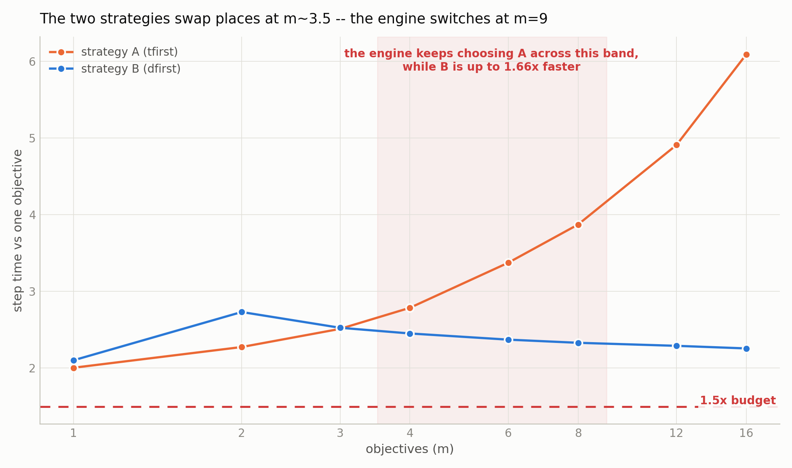

| m | strategy A (tfirst) | strategy B (dfirst) | faster | mem cost of B | time saved by B |
|---|---|---|---|---|---|
| 1 | 2.005 | 2.102 | A | 0.00% | -4.9% |
| 2 | 2.275 | 2.732 | A | 0.77% | -20.1% |
| 3 | 2.512 | 2.526 | A | 0.89% | -0.6% |
| 4 | 2.787 | 2.452 | B | 0.96% | 12.0% |
| 6 | 3.375 | 2.372 | B | 1.05% | 29.7% |
| 8 | 3.873 | 2.331 | B | 1.10% | 39.8% |
| 12 | 4.909 | 2.291 | B | 1.16% | 53.3% |
| 16 | 6.091 | 2.257 | B | 1.19% | 62.9% |

Shipped rule switches at: `attn.c_proj` m>=3, `attn.c_attn` m>=7, MLP linears m>=9, vocabulary head m>=148. Measured crossover: m~3.5.

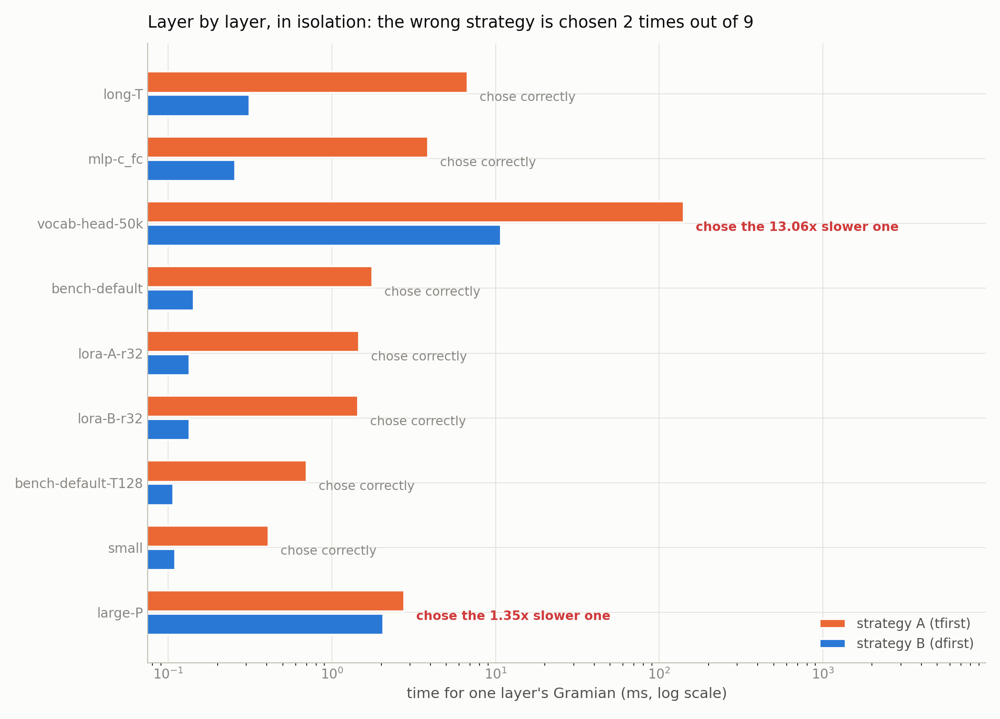

| shape (isolated kernel) | A ms | B ms | rule picks | verdict |
|---|---|---|---|---|
| long-T | 6.745 | 0.314 | dfirst | ok |
| mlp-c_fc | 3.869 | 0.257 | dfirst | ok |
| vocab-head-50k | 141.333 | 10.821 | tfirst | WRONG 13.06x |
| bench-default | 1.772 | 0.143 | dfirst | ok |
| lora-A-r32 | 1.463 | 0.135 | dfirst | ok |
| lora-B-r32 | 1.445 | 0.135 | dfirst | ok |
| bench-default-T128 | 0.702 | 0.107 | dfirst | ok |
| small | 0.411 | 0.110 | dfirst | ok |
| large-P | 2.773 | 2.054 | tfirst | WRONG 1.35x |

## 6. Capability limit

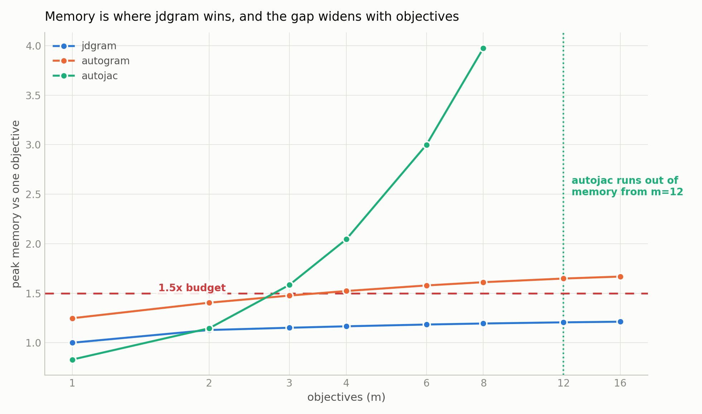

| engine | largest m that ran | smallest m that OOM'd |
|---|---|---|
| autogram | 16 | -- |
| autojac | 8 | 12 |
| jdgram | 16 | -- |

At m=24 and m=32 the single-objective control also OOMs — card limit, not an engine limit.

## 7. Held-out perplexity (100 steps, duplicate, T=512, dfirst)

| m | jdgram | autogram | autojac |
|---|---|---|---|
| 1 | 49.49 | 49.49 | 49.49 |
| 2 | 53.27 | 53.27 | 53.28 |
| 3 | 50.47 | 50.47 | 50.52 |
| 4 | 50.02 | 50.02 | 50.03 |
| 6 | 48.69 | 48.69 | 48.76 |
| 8 | 48.51 | 48.51 | 48.53 |
| 12 | 49.56 | 49.56 | -- |
| 16 | 50.57 | 50.57 | -- |

## 8. Reproducibility

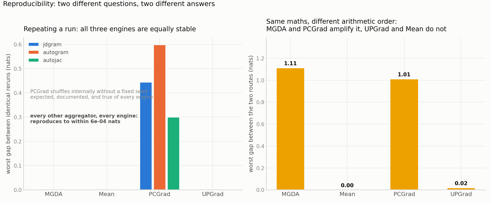

Identical rerun, worst val_ce gap (nats):

| aggregator | jdgram | autogram | autojac |
|---|---|---|---|
| MGDA | 0.00052 | 0.00062 | 0.00005 |
| Mean | 0.00000 | 0.00000 | 0.00008 |
| PCGrad | 0.44435 | 0.59903 | 0.29987 |
| UPGrad | 0.00011 | 0.00038 | 0.00001 |

Same maths via the two strategies, worst val_ce gap (nats):

| aggregator | gap |
|---|---|
| MGDA | 1.1119 |
| Mean | 0.0003 |
| PCGrad | 1.0114 |
| UPGrad | 0.0191 |

## 9. Objective alignment (min pairwise gradient cosine)

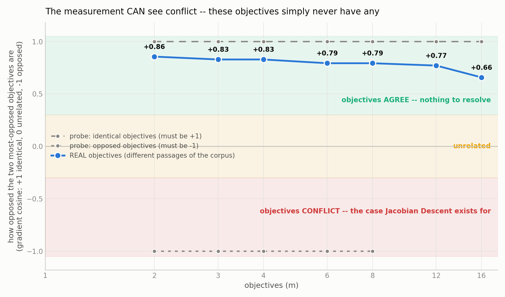

| objectives | 2 | 3 | 4 | 6 | 8 | 12 | 16 |
|---|---|---|---|---|---|---|---|
| duplicate | 1.000 | 1.000 | 1.000 | 1.000 | 1.000 | 1.000 | 1.000 |
| conflicting | -1.000 | -1.000 | -1.000 | -1.000 | -1.000 | -- | -- |
| independent | 0.856 | 0.828 | 0.828 | 0.793 | 0.793 | 0.770 | 0.658 |

## 10. Coverage

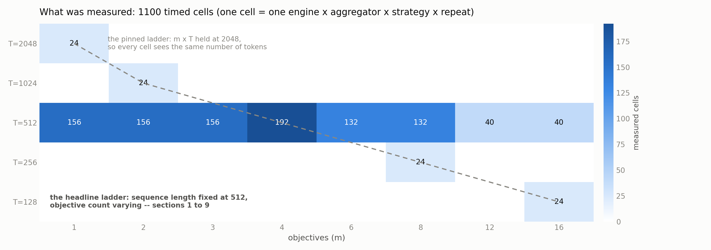

---

## 11. v12 router fix (11 Aug, after the campaign above)

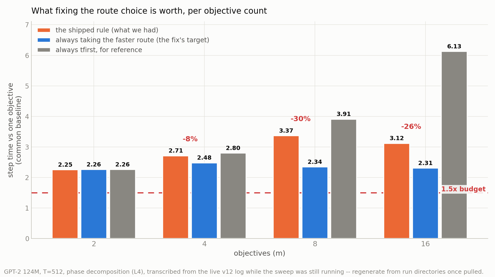

Calibration, 56 isolated shapes x m=1..16 on the same card:

|  | picks slower strategy | of those, >1.5x |
|---|---|---|
| shipped rule | 18 / 56 | 13 |
| measured cost model | 1 / 56 | 0 |

Whole-model phase decomposition (common baseline; saving in step ms):

| m | shipped rule | best strategy | saving |
|---|---|---|---|
| 2 | 2.252 | 2.260 | -0.3% |
| 4 | 2.709 | 2.478 | 8.5% |
| 8 | 3.369 | 2.345 | 30.4% |
| 16 | 3.117 | 2.306 | 26.0% |

Gramian accuracy vs brute force (L5):

| engine | relative error | tied-embedding case |
|---|---|---|
| jdgram | 3.8e-08 | 3.8e-08 (exact) |
| autogram | 1.0e-06 | 2.2e-06 (drops tied cross-terms) |
| autojac | 8.3e-05 | 5.3e-05 |

Gate suite: 58 -> 71 tests, all passing. Strategies agree numerically to 5.2e-06.

*Verification status: phase-level measured; whole-training-loop sweep incomplete (m=2 done, m=4 contended, m=8/16 OOM'd against a concurrent job).*

