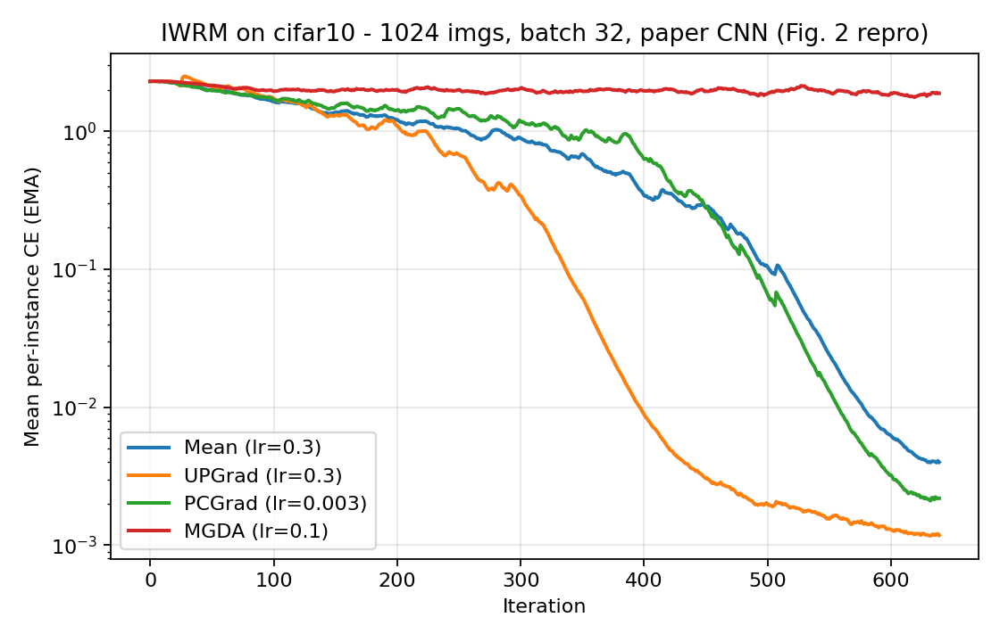
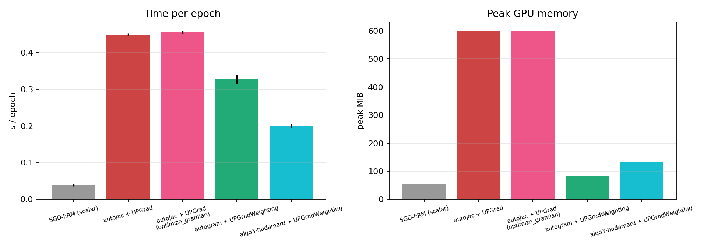
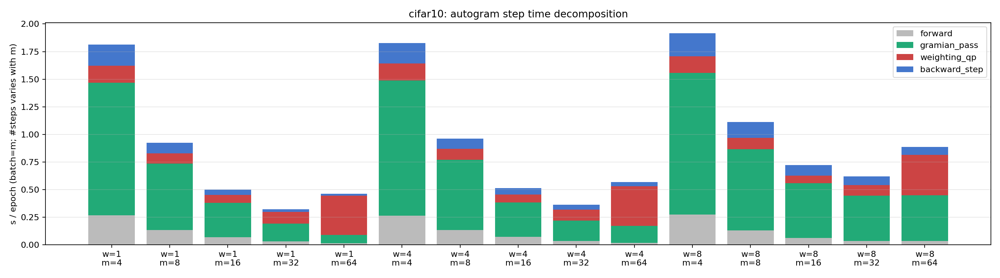
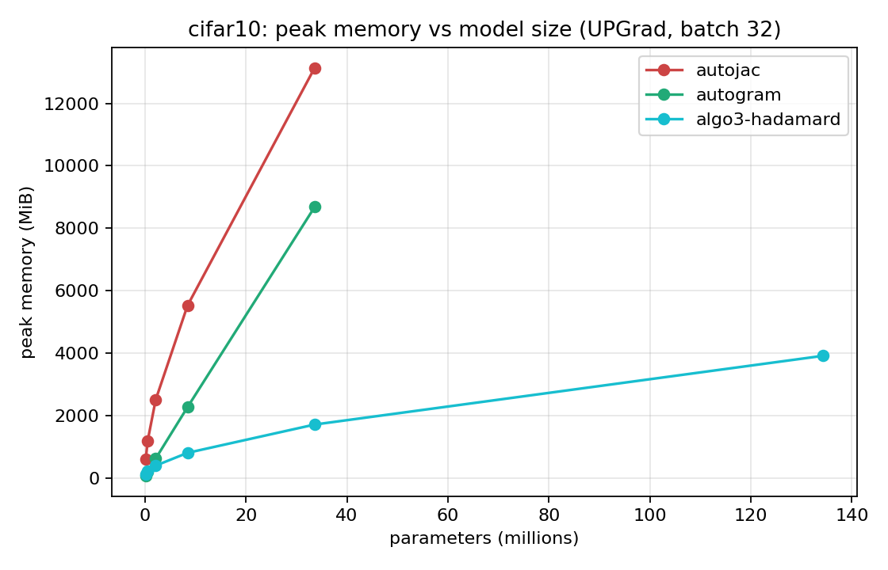
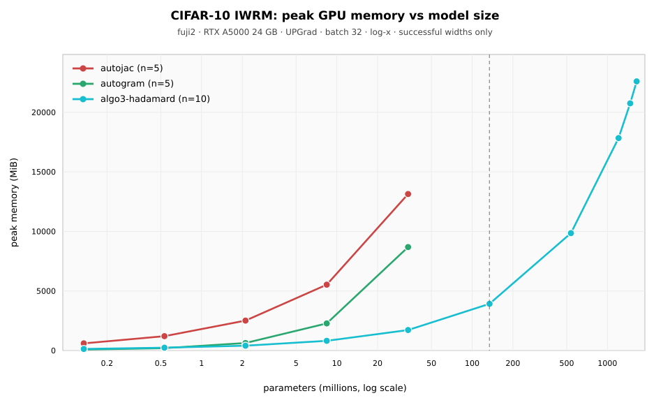

# Results — IWRM Benchmarks and Gramian Engine Comparison (CIFAR-10)

Independent reproduction of the small-scale IWRM experiments from
[*Jacobian Descent for Multi-Objective Optimization*](https://arxiv.org/abs/2406.16232)
(arXiv:2406.16232v3), followed by a capacity and timing comparison of TorchJD’s
execution engines against a custom Hadamard Gramian implementation
(then `hadamard.py`; now [`src/jdgram/`](../src/jdgram/)).

**Primary results:** fuji2, 21 July 2026.  
**Raw artifacts:** [`../results/cifar_fuji2/extensive/`](../results/cifar_fuji2/extensive/),
[`../results/cifar_fuji2/w106_112/`](../results/cifar_fuji2/w106_112/).  
**Figures used below:** [`../results/cifar_fuji2/`](../results/cifar_fuji2/).

---

## Environment and protocol

| | |
|---|---|
| Host | fuji2 — 4× NVIDIA RTX A5000 (24 GB) |
| Software | Python 3.10.20, PyTorch 2.4.1+cu121, TorchJD 0.17.x |
| GPU state before sweep | idle (~5 MiB used on each card) |

Earlier laptop (5070 Ti) and landonia (2080 Ti) runs are superseded for capacity
and engine timing. They remain useful only as evidence that TorchJD engines
already exhaust smaller GPUs.

**Protocol** (paper Appendix D unless noted):

- Architecture: CIFAR-10 CNN (Table 3), including grouped convolutions and ELU
- Data: 1024-image seeded subset, batch size 32, full-train-set channel
  normalisation (D.6); subset preloaded to GPU
- Optimiser: plain SGD without momentum (D.4); cross-entropy with
  `reduction='none'` (32 IWRM objectives per step)
- Learning rate: per-aggregator sweep by area under the loss curve (D.1),
  grid `0.0003 … 0.3`
- Timing: warmup + timed epochs bracketed by `cuda.synchronize()`; peak
  memory via `max_memory_allocated`
- Width multiplier `w` scales channel counts (and groups); `w = 1` is the
  paper architecture (~0.13M parameters)

**Preflight (4/4 gates passed on fuji2):**

1. UPGrad / UPGradWeighting `pref_vector` defaults match
2. `autogram` accepts the paper CNN; Gramian shape `(32, 32)`
3. autojac vs autogram multi-step trajectory: max parameter difference
   **2.0×10⁻⁶** (tolerance 5×10⁻⁴)
4. Custom `algorithm3` Gramian matches `autogram` (relative tolerance 10⁻⁴)

Engine comparisons below therefore use **equivalent update directions**, not
different aggregators.

---

## 1. Gramian computation paths

Jacobian Descent forms aggregator weights from the Gramian

$$G = J J^{\top} \in \mathbb{R}^{m \times m},$$

where each row of $J$ is the gradient of one objective with respect to the
parameters. Four practical ways to obtain $G$ are distinguished below.

### Path A — Full Jacobian materialisation (`autojac`)

TorchJD builds $J \in \mathbb{R}^{m \times P}$ explicitly (`backward` +
`jac_to_grad`) and then aggregates. Peak memory is dominated by the full
$m \times P$ block. This is the most direct autodiff formulation and the first
to fail as $P$ grows.

### Path B — VJP / hook-based Gramian (`autogram`)

TorchJD’s memory-oriented engine. The full end-to-end Jacobian is never
stored; during the backward pass, per-layer blocks
$J_{\ell} \in \mathbb{R}^{m \times P_{\ell}}$ are materialised (hooks /
`vmap`+`vjp`-style work) and accumulated as

$$G \leftarrow G + J_{\ell} J_{\ell}^{\top}.$$

Peak memory tracks the **largest layer**, $\mathcal{O}(m \cdot P_{\ell,\max})$,
rather than total parameter count. This is substantially more efficient than
Path A, but still linear in the widest layer.

### Path C — Column-wise / recursive Algorithm 3

The paper’s Algorithm 3 walks layers in reverse, maintains an upstream
gradient $A$, and accumulates layer contributions without forming a global
$J$. For a Linear layer with per-example outer products
$J_{W,i} = a_i x_i^{\top}$, a column-wise expansion of the Gramian is

$$G = \sum_{k=1}^{P_{\ell}} j_k j_k^{\top},$$

where $j_k$ is the $k$-th column of $J_{\ell}$. The identity is correct, but a
naive Python implementation (including an early per-group Conv2d loop) issues
a large number of tiny kernels and becomes dispatch-bound on GPU.

### Path D — Hadamard factorisation (`algo3-hadamard`)

For Linear weights, the outer-product structure yields

$$J_{W,i} = a_i x_i^{\top}
\quad\Rightarrow\quad
G_W = (A A^{\top}) \odot (X X^{\top}),$$

so $J_W$ is never allocated: only two $m \times m$ products and an
element-wise multiply. The bias term is $G_b = A A^{\top}$; upstream
propagation is $A \leftarrow A W$.

For grouped Conv2d, a compact per-example weight-Jacobian block is still
formed (unfold + one batched matmul over groups), then
$G \leftarrow G + J J^{\top}$. Vectorising the former per-group Python loop
removed the dispatch overhead that previously made Path C unusable at scale.

**Memory scaling.** On this CNN, parameters are dominated by
`Linear(1024w, 128w)` ($\propto w^{2}$). That layer’s Gramian cost under Path D
is $\mathcal{O}(m^{2})$, independent of its parameter count, which explains
the observed sub-linear growth of peak memory in $P$ (e.g. $w=32\to 64$:
~4× parameters, ~2.5× peak MiB).

**Current scope limits of Path D:**

- IWRM-shaped per-instance losses (row $i$ of $A$ corresponds to instance $i$).
  Batch-mixing layers such as BatchNorm invalidate that assumption.
- Manual reverse traversal of `nn.Sequential` only (Conv2d, Linear, ELU,
  MaxPool2d, Flatten). Residuals, attention, and LayerNorm are not yet
  supported.
- Multi-objective RL with batch-averaged component losses requires a different
  identity; that derivation is pending confirmation of the loss construction.

---

## 2. Figure 2 — aggregator convergence

Learning-rate sweep on fuji2 (AUC = sum of per-step mean cross-entropy;
paper D.1 criterion):

| Aggregator | Selected lr | AUC | Notes |
|---|---|---|---|
| Mean | 0.3 | 494.72 | Grid endpoint |
| UPGrad | 0.3 | 380.68 | Grid endpoint; lowest AUC |
| PCGrad | 0.003 | 575.01 | Diverges for every lr ≥ 0.01 |
| MGDA | 0.1 | 1263.68 | Weak / stalled learning |

**Findings**

- UPGrad outperforms Mean on AUC (381 vs 495), matching the paper’s qualitative
  CIFAR-10 result and validating the harness before engine work.
- PCGrad sums projected gradients (paper Eq. 33) rather than averaging them;
  at $m = 32$ the update magnitude is unstable unless the learning rate is
  kept very small.
- MGDA underperforms, consistent with known sensitivity to small gradients.

**Caveat.** Mean and UPGrad both select the top of the tested grid; a wider
grid may shift the absolute optimum. Ordering, not absolute lr, is the
relevant check for this reproduction.

---

## 3. Table 7 — per-aggregator timing ratios

| Method | s/epoch (fuji2) | Ratio (Mean = 1) | Paper ratio (L4, Mean = 1) |
|---|---|---|---|
| SGD-ERM | 0.033 ± 0.001 | 0.09 | 0.28 |
| Mean | 0.355 ± 0.002 | 1.00 | 1.00 |
| UPGrad | 0.449 ± 0.003 | 1.26 | 1.14 |
| PCGrad | 0.741 ± 0.003 | 2.08 | 1.78 |
| MGDA | 0.940 ± 0.228 | 2.64 | 2.97 |

Source: [`../results/cifar_fuji2/table7_cifar10.md`](../results/cifar_fuji2/table7_cifar10.md).

Ordering matches the paper (SGD < Mean < UPGrad < PCGrad < MGDA). Absolute
times differ across GPUs and TorchJD versions; **ratios** are the appropriate
comparison. UPGrad/Mean (1.26 vs 1.14) is close to the published figure.
MGDA’s large standard deviation is consistent with its iterative QP solve.

---

## 4. Engine comparison at paper scale ($w = 1$)

Same UPGrad weights, same data order, batch 32:

| Configuration | Path | s/epoch | Peak MiB |
|---|---|---|---|
| SGD-ERM (scalar) | baseline | 0.039 | 54 |
| autojac + UPGrad | A | 0.448 | 602 |
| autojac + UPGrad (`optimize_gramian`) | A | 0.456 | 602 |
| autogram + UPGradWeighting | B | 0.327 | 82 |
| algo3-hadamard + UPGradWeighting | D | **0.201** | **134** |

**Findings**

1. **Path B vs Path A.** `autogram` uses approximately 7× less peak memory than
   `autojac` (82 vs 602 MiB) and is faster (0.33 vs 0.45 s/epoch).
2. **`optimize_gramian_computation`.** No memory benefit on this model at
   paper width; slightly slower. Not pursued further.
3. **Path D vs Path B.** At paper scale, the Hadamard engine is **faster**
   than `autogram` (0.20 vs 0.33 s/epoch) with a modest memory premium
   (134 vs 82 MiB). Earlier reports that Hadamard was ~2.5× slower referred to
   a pre-vectorisation Conv2d loop and do not apply to the current code.

---

## 5. Step-time decomposition (`autogram`)

One `autogram` step is split into `forward`, `gramian_pass`, `weighting_qp`,
and `backward_step` across objective count $m$ (batch size) and model width.

QP share of epoch time (fuji2):

| Width (params) | $m=4$ | $m=8$ | $m=16$ | $m=32$ | $m=64$ |
|---|---|---|---|---|---|
| 1 (0.13M) | 8.5% | 10.3% | 14.5% | 32.3% | 77.1% |
| 4 (2.11M) | 8.4% | 10.0% | 14.2% | 27.7% | 63.6% |
| 8 (8.42M) | 7.9% | 9.2% | 9.5% | 15.4% | 41.5% |

At RL-relevant objective counts ($m = 4$–$16$), Gramian accumulation dominates
and the QP share remains secondary, especially as width increases. At
$m = 64$, sequential CPU QP solving dominates (up to 77%). GPU-resident /
batched QP work (e.g. via jacopt) is therefore relevant for large $m$, but it
is not the reason Path D outperforms Path B at $m = 32$.

Synced wall-clock segments at $w=8$, $m=32$ agree: Hadamard’s fused
forward+Gramian cost is roughly half of `autogram`’s `gramian_pass`
(~5.7 ms vs ~13.7 ms per step). Profiler-reported peak memory (~15 GB) is
inflated relative to clean `scaling` measurements; **scaling peak MiB is
treated as ground truth**, with profiler output used for operator timelines
only.

---

## 6. Memory and capacity scaling

Merged measurements (fuji2 A5000 24 GB, UPGrad, batch 32):
[`../results/cifar_fuji2/scaling_cifar10.json`](../results/cifar_fuji2/scaling_cifar10.json).

**Shared widths (all three engines; $w \le 32$):**

**Full successful range (log-$x$; Hadamard through $w=112$):**

| Width | Params | autojac (A) | autogram (B) | algo3-hadamard (D) |
|---|---|---|---|---|
| 1 | 0.13M | 0.44 s / 602 MiB | 0.30 s / 82 MiB | **0.19 s / 134 MiB** |
| 2 | 0.53M | 0.77 s / 1206 MiB | 0.31 s / 203 MiB | **0.21 s / 239 MiB** |
| 4 | 2.11M | 1.49 s / 2515 MiB | 0.35 s / 633 MiB | **0.23 s / 407 MiB** |
| 8 | 8.42M | 3.12 s / 5530 MiB | 0.62 s / 2278 MiB | **0.33 s / 816 MiB** |
| 16 | 33.6M | 7.18 s / 13140 MiB | 1.63 s / 8686 MiB | **0.57 s / 1722 MiB** |
| 32 | 134M | **OOM** | **OOM** | **1.10 s / 3922 MiB** |
| 64 | 537M | — | — | **2.46 s / 9856 MiB** |
| 96 | 1.21B | — | — | **4.56 s / 17839 MiB** |
| 106 | 1.47B | — | — | **4.92 s / 20754 MiB** |
| **112** | **1.65B** | — | — | **5.32 s / 22598 MiB** |
| 128 | 2.15B | — | — | **OOM** |

**Findings**

1. **TorchJD ceiling (24 GB).** Paths A and B both OOM at $w=32$ (134M
   parameters). The last successful TorchJD width is $w=16$ (33.6M).
2. **Hadamard ceiling (24 GB).** Last success: $w=112$ (1.65B parameters,
   22.6 GB peak). First failure: $w=128$. Relative to TorchJD’s first-fail
   width this is approximately **12×** more parameters; relative to TorchJD’s
   last success, approximately **49×**. The conservative figure quoted below
   is **12×**.
3. **Speed on shared widths.** Path D is faster than Paths A and B at every
   width where all three complete. At $w=16$: 0.57 s/epoch vs 1.63 s/epoch
   for `autogram` (~3×).
4. **Memory at $w=16$.** Path D: 1.7 GB; Path B: 8.7 GB; Path A: 13.1 GB.
5. **Interpretation for LLM-scale discussion.** 1.65B parameters on this
   width-scaled CNN is a **Gramian-path capacity stress test**, not a claim
   that a 1.7–2B transformer can already be trained with this code. The
   parameter-count comparison is still informative for multi-objective JD
   on Linear-dominated models.

OOM rows for `autogram` ($w=32/64/128$) and Hadamard ($w=128$) were recorded
cleanly by the profile harness
([`../results/cifar_fuji2/extensive/g3/profile_cifar10_summary.json`](../results/cifar_fuji2/extensive/g3/profile_cifar10_summary.json)).

---

## 7. Caveats

- **Single seed** (seed = 1). The paper reports eight seeds with SEM bands.
  Qualitative aggregator ordering is sufficient for engine decisions; paper-
  strict claims require multi-seed runs.
- **Learning-rate grid endpoints** for Mean and UPGrad — the true optimum may
  lie above 0.3.
- **PCGrad NaNs** at high learning rates are expected from the algorithm, not
  a harness defect.
- **Architecture** is a width-scaled paper CNN, not a transformer.
- **Profiler peak memory ≠ scaling peak memory.** Use scaling for MiB figures.
- **IWRM ≠ RL loss.** Extending the Hadamard identity to batch-averaged
  multi-component RL objectives remains open.
- Earlier laptop / landonia timing documents that described Hadamard as slow
  are **obsolete** for the vectorised implementation.

---

## 8. Next steps

**Completed for this report:** fuji2 extensive sweep, $w=106/112$ ceiling
probe, preflight 4/4, removal of multi-GB init checkpoints from the cluster.

**Near term**

1. Confirm the RL **loss construction** (per-instance vs per-component
   batch-averaged) and target $m$ / batch size, then derive the corresponding
   Gramian identity.
2. Triton fused kernel for $(A A^{\top})\odot(X X^{\top})$.
3. GPU-resident / batched dual-cone QP via [jacopt](https://github.com/rzhu3/jacopt).
   At small $m$ this is not the dominant cost; it remains worthwhile as a
   collaborative, bounded improvement to the CPU round-trip.
4. Optional: Perfetto busy-ratio on the $w=64$ Hadamard trace. The traces were
   not retained off-cluster (hundreds of MB each); regenerate with
   `iwrm_bench.py profile` before doing this.
5. SVHN pass and multi-seed runs when paper-strict reproduction is required.

**Later.** Extend layer coverage beyond `nn.Sequential`; integrate into the
RL training stack once the call site (losses → UPGrad → Adam) is fixed.

---

## Appendix — artifacts

| Artifact | Location |
|---|---|
| Fuji2 sweep log | `../results/cifar_fuji2/extensive/extensive_20260721_133325.log` |
| Merged scaling JSON | `../results/cifar_fuji2/scaling_cifar10.json` |
| Engines / Figure 2 / decompose | `../results/cifar_fuji2/*.png`, `../results/cifar_fuji2/*.json` |
| Full-range scaling figure | `../results/cifar_fuji2/scaling_cifar10.svg` |
| $w=106/112$ probe | `../results/cifar_fuji2/w106_112/` |
| Profile summaries | `../results/cifar_fuji2/extensive/g3/` (traces not retained) |
| Engine, at the time | `hadamard.py`, `iwrm_bench.py` |
| Engine, now | [`src/jdgram/`](../src/jdgram/), [`legacy/cifar/`](../legacy/cifar/) |
